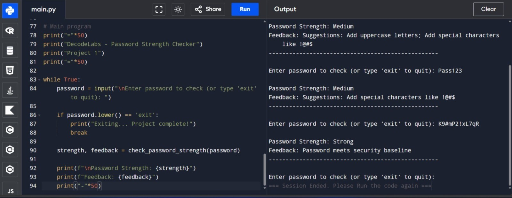

# week1-decodelabs-project
Week 1 - Cybersecurity  | Decodelabs Internship. Responsive web application developed with HTML, CSS, and JavaScript. Focuses on password strength checker, phishing attack prevention, data protection, and cybersecurity best practices

